# App

## App name on device

Hologram

## App name on store

One of:

- Hologram Messenger
- Hologram DIDComm Messenger
- Hologram Wallet & Messenger
- Hologram Messenger & Wallet

## App Description on store

One of:

- Messaging with Verifiable Credentials
- Messaging & Verifiable Credentials
- Decentralized Messaging & Verifiable Credentials

## App Category

- Social Networking (preferred)
- Messaging

## Brief

### Creatives we need

- App icon
- Previews
- Other Banner (google play only)
- App splash screen

### What we used for the app

Font: Euclid Circular A

2060.io brand colors:

#3EBDB6
#7678ED

See website [https://2060.io](https://2060.io)

For the App we are only using the #3EBDB6 green.

### Guidelines

The name of the brand is "2060", but brand name of the App will be "Hologram". Web site will be updated accordingly.

For that reason, you are free to use other colors for the creatives (icon, previews, other banners, app splash screen), the only requirement is that it must combine with the #3EBDB6 green at some point in the app. By seeing the attached screenshots, you will see that we are using very few colors.

App icon not necessarily must use the #3EBDB6 green. But other creatives (Previews, etc) must combine with app colors.

#### Main concepts of the app - for giving ideas for the icon:

- **Innovation**: Hologram is a chat app AND a verifiable credential wallet. Verifiable credential is a relatively new standardized concept which deals with issuance of credentials (such as ID card) to users, users can then present their verifiable credentials to a receptor (chatbot service, other user) and receptor can instantly verify the credential is authentic. No other messaging app is providing Verifiable Credential features.
- **Decentralized**: Hologram is working thanks to a decentralized network. No one controls the network. Network is open, anyone can provide a chatbot service to it, any user can scan a chatbot QR code and start to interact with it. Anyone can develop and provide another mobile app like Hologram, it will be compatible with Hologram (user will be able to interact between different apps). Protocol used for the network is open source.
- **Trustable**: Hologram aims providing trustable services. User will be able to clearly identify a service provider (company name, ...) before connecting to a service.
- **Self-custody**: No need to create an account in order to use Hologram. No need to verify a phone number, an email address... absolutely no data of the end user is collected.

#### Sources of inspiration

- **Hologram**: an hologram is a 3D image which is the result of interferences between several signals.
- **modernity, web3, innovation**: some time ago we designed a first concept for 2060.io. I put the related creatives in the "old" directory. These creatives have a great sense of modernity, web3, but these are not directly suitable for an app icon. Maybe the old/home-open.png, the old/integrate-dapps.png could be of interest. The old/operate-agency.png shows an hologram (in the cube) which is the result of the interferences of several signals. I like the glow effect of the old/home-open.png.

## Icon

### Store Constraints

#### Apple App Store

- Final size: 1024px x 1024px

[Details](https://developer.apple.com/design/human-interface-guidelines/app-icons)

#### Google Play Store

When creating your artwork, ensure it conforms to the following:

- Final size: 512px x 512px
- Format: 32-bit PNG
- Color space: sRGB
- Max file size: 1024KB
- Shape: Full square – Google Play dynamically handles masking. Radius will be equivalent to 20% of icon size.
- Shadow: None – Google Play dynamically handles shadows. See 'Shadows' section below on including shadows within your artwork.

[Details](https://developer.android.com/distribute/google-play/resources/icon-design-specifications)

## Screen captures (Topics or Preview)

Each topic must have an illustration. Total 7 topics/preview/screenshot. Example of a topic with signal on app store:

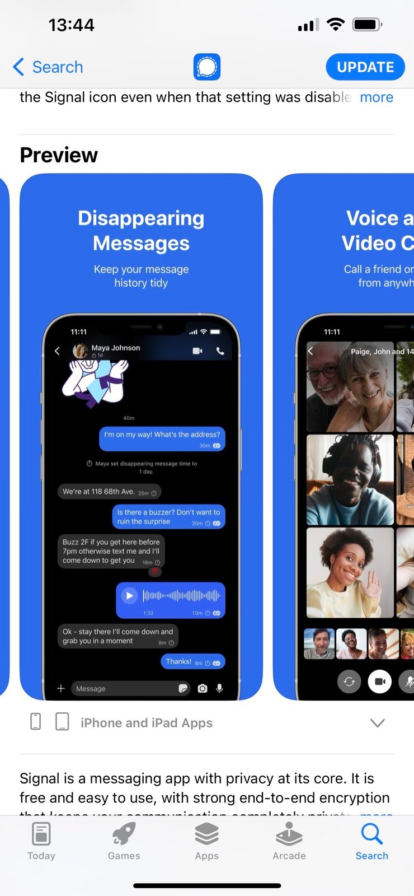
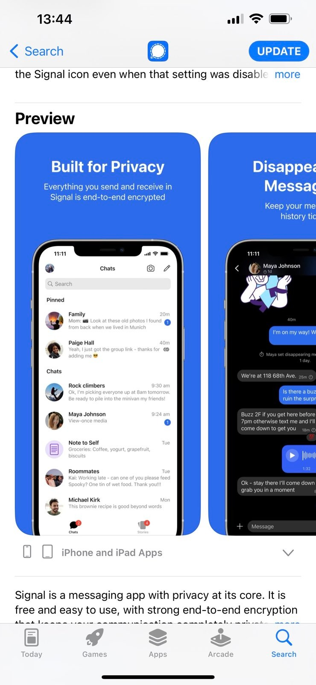

### Store Constraints

#### Apple App Store

Must look like iOS device (sample screenshots are iOS screenshots)

|                     | Apple App Store                                                                                                                                  | Aspect Ratio | Needed |   |
|---------------------|--------------------------------------------------------------------------------------------------------------------------------------------------|--------------|--------|---|
| iPhone 6.7" Display | Drag up to 3 app previews and 10 screenshots here.  (1290 x 2796px or 2796 x 1290px)                                                             |   2.16744186 | yes    |   |
| iPhone 6.5" Display | Drag up to 3 app previews and 10 screenshots here.  (1242 x 2688px, 2688 x 1242px, 1284 x 2778px or 2778 x 1284px)                               |  2.164251208 | yes    |   |
| iPhone 6.1" Display | Drag up to 3 app previews and 10 screenshots here.  (1179 x 2556px or 2556 x 1179px)                                                             |  2.167938931 | yes    |   |
| iPhone 5.8" Display | Drag up to 3 app previews and 10 screenshots here.  (1125 x 2436px, 2436 x 1125px, 1080 x 2340px, 2340 x 1080px, 2532 x 1170px or 1170 x 2532px) |  2.165333333 | yes    |   |
| iPhone 5.5" Display | Drag up to 3 app previews and 10 screenshots here.  (1242 x 2208px or 2208 x 1242px)                                                             |  1.777777778 | yes    |   |
| iPhone 4.7" Display | Drag up to 3 app previews and 10 screenshots here.  (750 x 1334px or 1334 x 750px)                                                               |  1.778666667 | yes    |   |

#### Google Play Store

Phone screen-shots:	Upload 2-8 phone screenshots. Screenshots must be PNG or JPEG, up to 8 MB each, 16:9 or 9:16 aspect ratio, with each side between 1,080 px and 3,840 px

Must look like Android device (sample screenshots are iOS screenshots)

### Topics

#### Topic #1 - Build trusted interactions

Collect and present Verifiable Credentials

(illustration: show chat with presentation request / presentation of an Identity credential) either dark or light

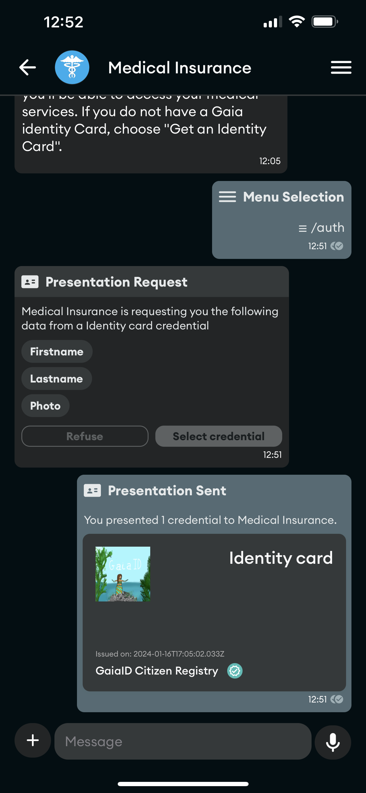
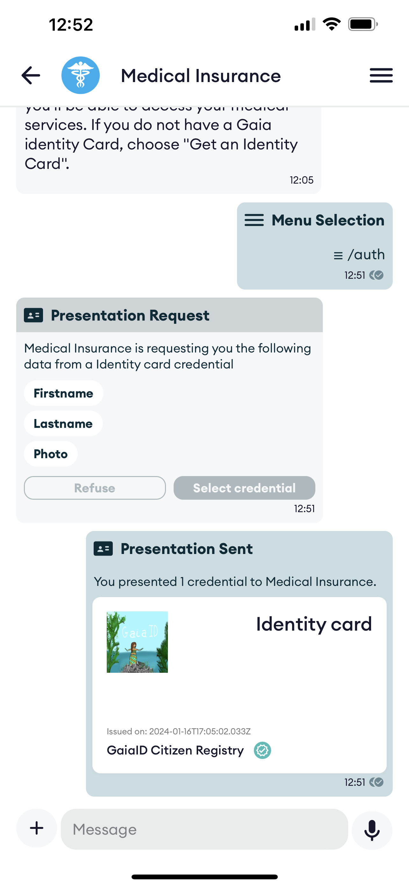

#### Topic #2 - Self Custody

No account! Your data is only stored on your phone. You are in control.

(illustration: show detail of settings)

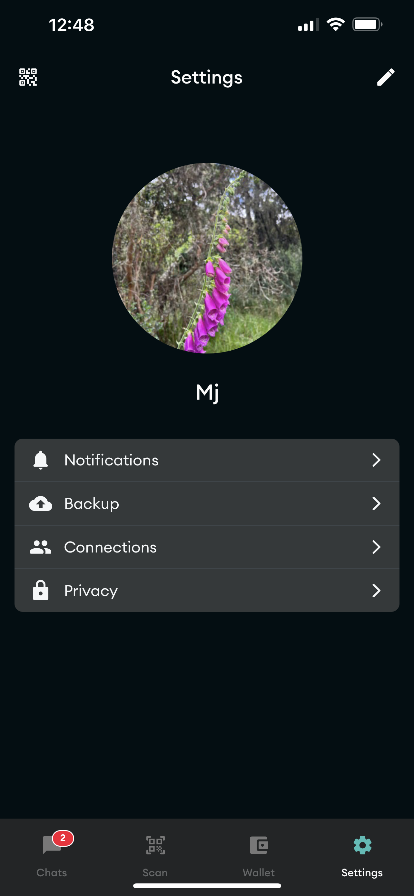
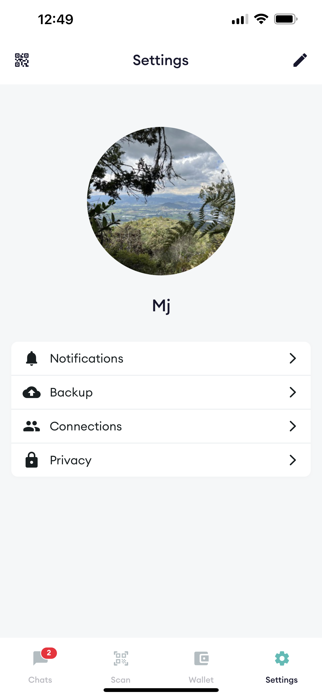

#### Topic #3 - Verifiable Credentials

Keep your Verifiable Credentials in your private Wallet

(illustration: show detail of credentials)

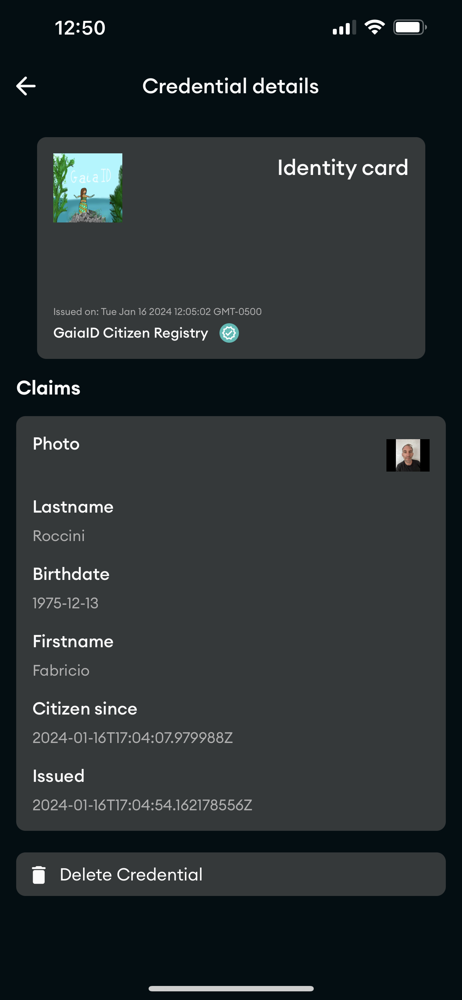
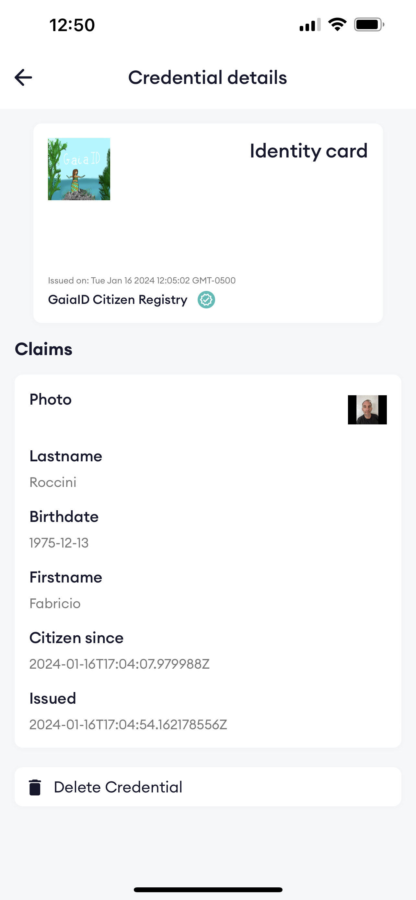

#### Topic #4 - Decentralized, peer to peer and open

Powered by the DIDComm protocol, an new open standard for decentralized services and verifiable credentials.

(illustration: show chat list)

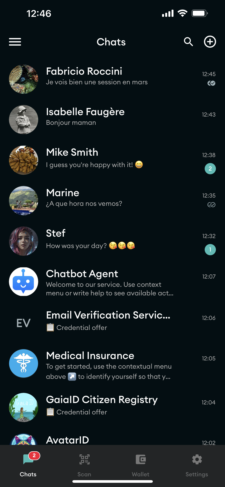
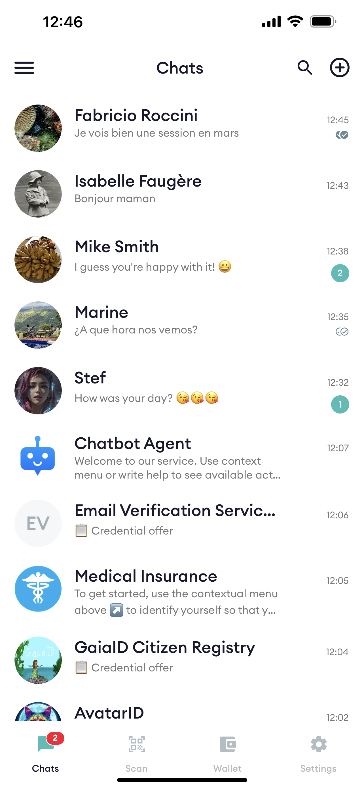
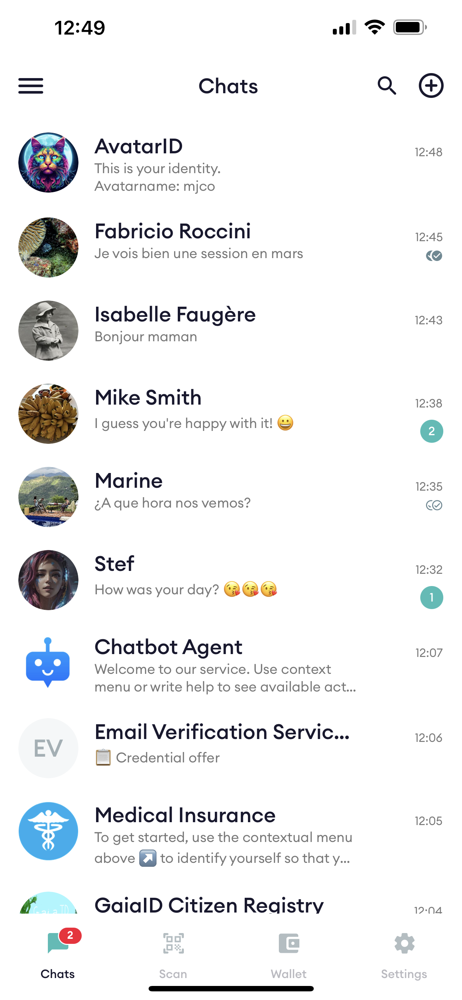

#### Topic #5 - Menus in conversational services

For advanced interactions and powerful conversational services.

(illustration: show chat list)

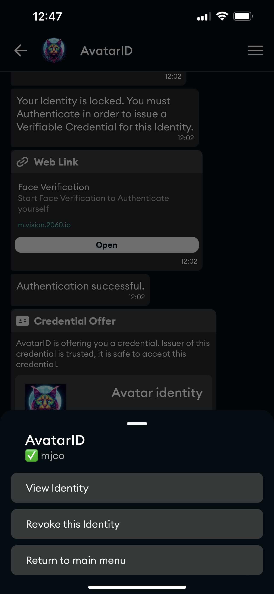
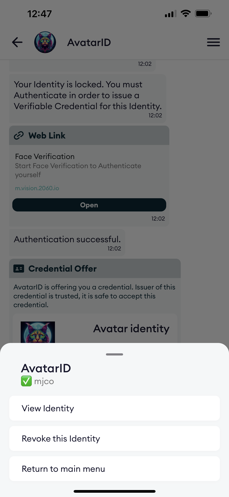

#### Topic #6 - Privacy

End-to-end ciphered

(illustration: show chat with message connection is secure)

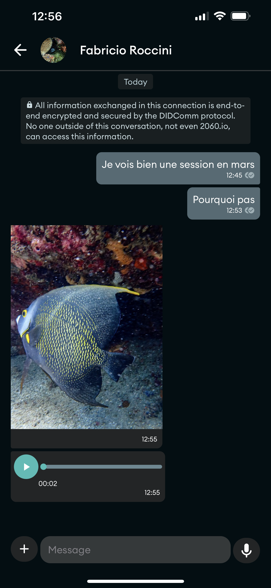
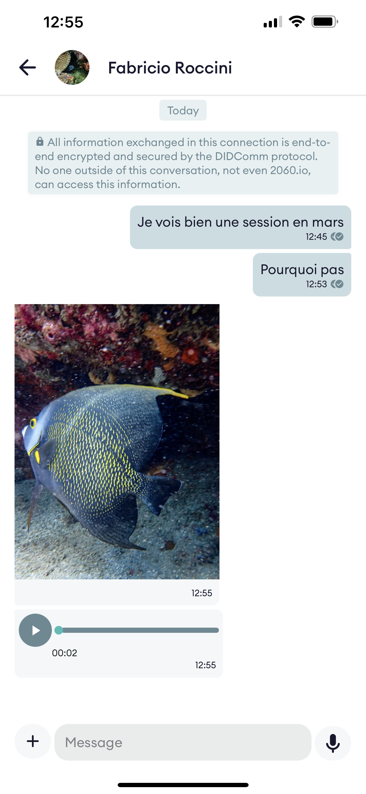

#### Topic #7 - No Spam!

Only people that you invited can talk to you!

(illustration: show chat with message connection is secure)

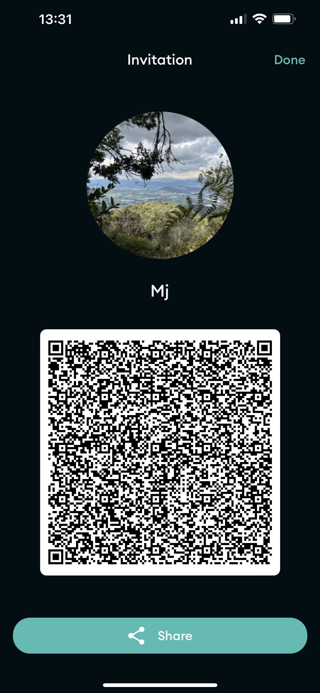
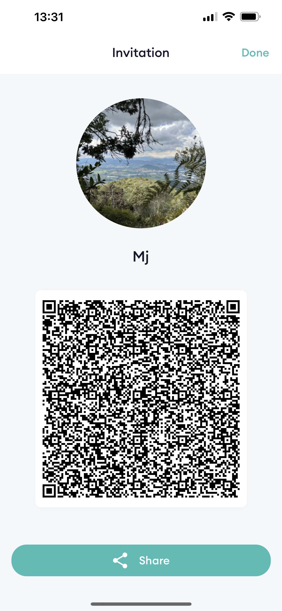

## Other Banners

### Store Constraints

#### Apple App Store

#### Google Play Store

Feature Graphics: Used sometimes for advertising or when providing a video. Your feature graphic must be a PNG or JPEG, up to 15 MB, and 1,024 px by 500 px.

[See these details](https://www.apptamin.com/blog/feature-graphic-play-store/)

## Spash screen

We need the App splash screen which is shown when App starts or when it is in background